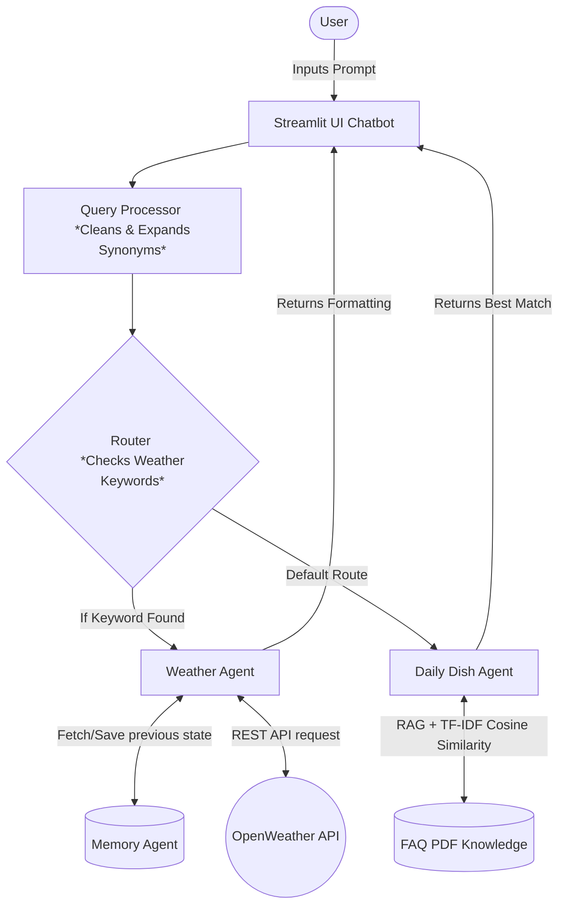

# Lab: Building AI Agents from Scratch with Python

**Estimated time needed:** 30 minutes

## Overview
This lab powers real-world applications such as a **Weather AI Agent** and **The Daily Dish customer-service chatbot**. In this hands-on project, you’ll apply core agentic AI principles to solve practical problems, design and orchestrate multi-agent systems, integrate external tools, memory, and document-based knowledge sources, and implement intelligent routing between specialized agents.

This project has been further enhanced with a **Streamlit Web UI** for a seamless chatting experience and includes a **GitHub Actions workflow** for automated cloud deployment.

This lab is ideal for software engineers and machine learning engineers who want to understand how AI agents work under the hood and learn how to build agent-based systems from first principles using Python.

## Objectives
By the end of this lab, learners will be able to:
- Understand the core concepts of AI Agents and Multi-Agent Systems (MAS).
- Build a Weather AI Agent from scratch to retrieve and process external data using the OpenWeather API.
- Develop a customer-service chatbot for The Daily Dish using a PDF-based knowledge source (TF-IDF Vectorization & PyPDF2).
- Implement agent memory to retain context and enable more personalized interactions.
- Design and integrate a multi-agent architecture where specialized agents collaborate to solve real-world problems.
- Integrate a chat interface easily with Streamlit for local testing and cloud deployments.

## Table of Content
1. Setup and Prerequisites
2. AI Agents Architecture
3. MemoryAgent
4. Weather Agent
5. The Daily Dish Agent
6. Routing Queries
7. Chatbot Function: Process User Queries
8. Running the Application (Streamlit GUI)
9. Deployment Setup

---

## 1. Setup and Prerequisites

### Requirements
- Python 3.8+
- Active internet connection for API services and initial PDF downloading.

### Installation
1. Clone the repository and navigate to the project directory:
   ```bash
   git clone <your-repository-url>
   cd weather_daily_dish
   ```
2. Create and activate a virtual environment:
   ```bash
   python -m venv venv
   source venv/bin/activate  # On Windows use: venv\Scripts\activate
   ```
3. Install the required dependencies:
   ```bash
   pip install -r requirements.txt
   ```

### API Key Configuration
To use the **Weather Agent**, you need a free OpenWeather API key.
Create a local secrets file for Streamlit:
```bash
mkdir .streamlit
```
Inside `.streamlit/secrets.toml`, add your API key:
```toml
OPENWEATHER_API_KEY = "your-openweather-api-key"
```

---

## 2. AI Agents Architecture
The architecture is based on a Multi-Agent System (MAS), composed of sub-agents that perform specialized tasks seamlessly. It uses a **Router** function to act as the primary interface, dispatching queries to the appropriate specialized sub-agent based on intent.



## 3. MemoryAgent
The `MemoryAgent` provides short-term context. It stores recent queries and data natively in memory dictionaries, allowing stateful conversations (e.g., retrieving previous weather updates if the user asks a follow-up question).

## 4. Weather Agent
The `WeatherAgent` leverages external APIs to hook real-time capabilities into the chatbot. It natively constructs requests given a city string, parses the JSON payload from the **OpenWeather API**, and returns a conversational summary involving temperature and weather description.

## 5. The Daily Dish Agent
The `DailyDishAgent` handles restaurant inquiries using RAG (Retrieval-Augmented Generation) principles. It reads the local PDF `The-Daily-Dish-FAQ.pdf`, cleans the text using regular expressions (`re`), builds TF-IDF vectors using `scikit-learn`, and maps incoming user questions to the exact FAQ response via **Cosine Similarity**.

## 6. Routing Queries
The `route_query` capability decides where the unstructured natural language inputs should be sent. By using optimized keyword searching and query processing (with synonyms injection like "fish" -> "seafood"), it properly distinguishes between regular restaurant queries and real-time weather inquiries.

## 7. Chatbot Function: Process User Queries
The main execution loop operates dynamically to provide answers. The Chatbot wraps the logic together: it reads the prompt from the user, engages the Router to pick the relevant logic tree, calls the chosen Agent, and echoes the returned output into the chat session. This has been beautifully encapsulated in the `app.py` Streamlit script.

---

## 8. Running the Application 🚀

You can interact with the chatbot in two ways:

**Option 1: Jupyter Notebook (Core Lab)**
Run the main notebook to understand the foundational agent mechanisms.
```bash
jupyter notebook main.ipynb
```

**Option 2: Streamlit UI (Enhanced)**
Launch the beautiful Web GUI chatbot built on top of the lab's core engine:
```bash
streamlit run app.py
```

---

## Deployment (Hugging Face Spaces)
The repository includes an automatic GitHub Actions workflow (`.github/workflows/deploy_hf.yml`) that can deploy your Streamlit chatbot straight to **Hugging Face Spaces**.

**To use the deploy action:**
1. Create a Hugging Face Space (Streamlit).
2. Grab your Access Token securely from Hugging Face Settings.
3. In your GitHub repository, configure a Secret named `HF_TOKEN`.
4. In your **Hugging Face Space**, go to **Settings > Variables and secrets** and create a new secret named `OPENWEATHER_API_KEY` with your API key.
5. Update `deploy_hf.yml` with your HF username and space name.
6. Push to the `main` branch!

---

## Congratulations!
You've successfully gained hands-on experience in building and integrating AI agents. You learned the core concepts of AI Agents and Multi-Agent Systems (MAS), created a Weather AI Agent to retrieve and process real-world data, developed a customer-service chatbot for The Daily Dish using a PDF-based knowledge source, and successfully deployed it behind a modern chat UI!
